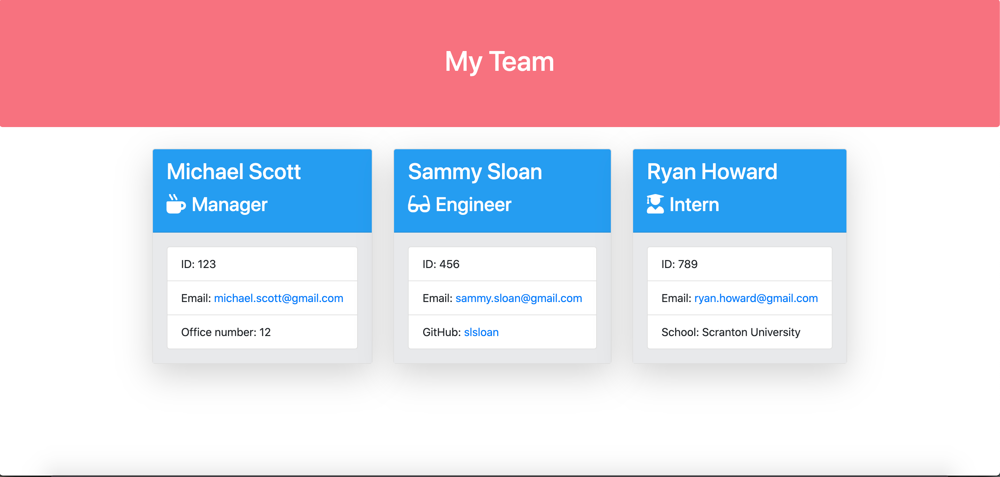
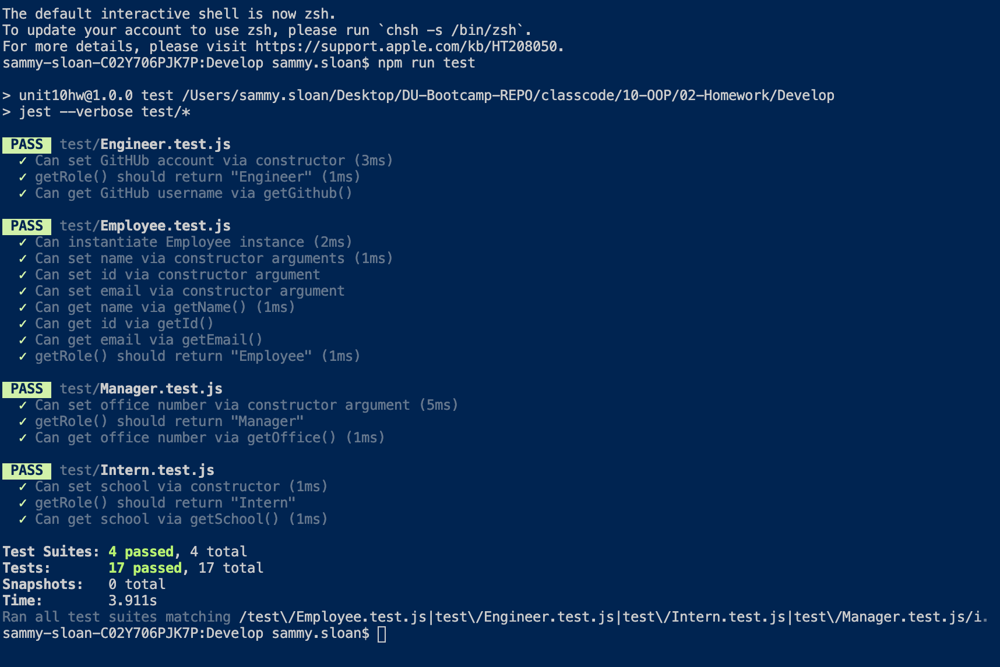

# Unit 10 OOP Homework: Template Engine - Employee Summary


## Objective
Build a software engineering team generator command line application. The application will prompt the user for information about the team manager and then information about the team members. The user can input any number of team members, and they may be a mix of engineers and interns. This assignment must also pass all unit tests. When the user has completed building the team, the applicaiton will create an HTML file that displays a nicely formatted team roster base on the information provided by the user. </br>


 </br>

# User Story
```
As a manager
I want to generate a webpage that displays my team's basic info
so that I have quick access to emails and GitHub profiles
``` 

# Test Results

</br>

# Copyright:
Sammy Sloan

© 2020 All Rights Reserved